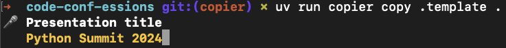

# How it works?

<v-clicks depth=2>

1. Run to copy  `copier copy source-template destination-solution`
   
2. Answer questions from config file   

3. Magic
 
4. Resolve Conflicts 

5. If we have any Conflicts

6. Success generated project, ready to use.

</v-clicks>

::right::

 
<v-clicks>
</v-clicks>
<!-- Bunch of questions 
copier.yml -> jinja2 -> Resolve conflicts
Run Command -> Questions -> Magic -> Resolve Conflicts -> Result
-->