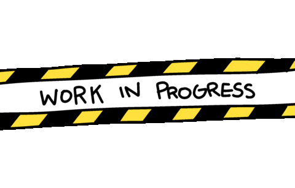

# New Project
To start a new project, use Copier to generate it from a template.

<v-clicks>

* inspire by: [https://github.com/fastapi/full-stack-fastapi-template](https://github.com/fastapi/full-stack-fastapi-template)
* [https://github.com/KuligKamil/full-stack-fastapi-vue-template](https://github.com/KuligKamil/full-stack-fastapi-vue-template)
* Behind the scene is Vue.js, JavaScript, Python, FastAPI.
* Copier Features: source from github link.
  
</v-clicks>

::right::

 
