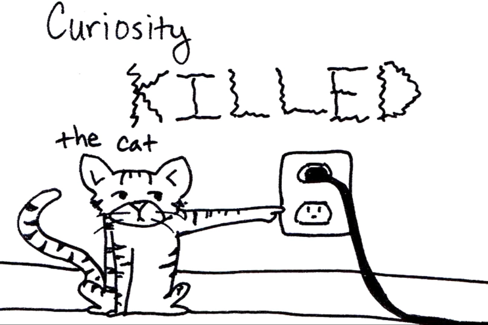

# Why Copier?

<v-clicks depth="2">

* We were unaware of Copier.
  Cookiecutter was not ideal for existing projects - my case at work involved multi repo, which was resolved in 15 minutes.
* Easy, fast & useful tool better than other tools 😉
* FastAPI template moved from CookieCutter to Copier
* Rule ABC - Always Be Curious!

</v-clicks>

::right::

  

Picture From I DON't KNOW WHO
<!-- TODO: GENERATE PICTURE OF ANGERY  SQL DEVELOPER  -->
<!--  -->

<v-clicks>

<!-- 

  * <a href="https://db-engines.com/en/ranking">DB-Engines Ranking</a>, 
  <a href="https://survey.stackoverflow.co/2024/technology#most-popular-technologies-database"> StackOverflow 2024 Survey Developer - Database Results</a>

 -->

</v-clicks>

<!-- 
TODO: use components for two links, maybe use slot
I never use commercially use MongoDB or NoSQL Database.
I always use Relational Databases. Mostly PostgreSQL.
I always want to try something new.

> If you can’t explain it to a six-year-old, you don’t understand it yourself.
Not sure who

> You don't have to be an expert, just know more than the person learning from you.
Not sure who

> The best option to learn something new is to create workshop. You have perfect motivation, deadline. 
Kamil Kulig

Clients often don't know what they want 
MongoDB can make it easier to create MVPs

--> 