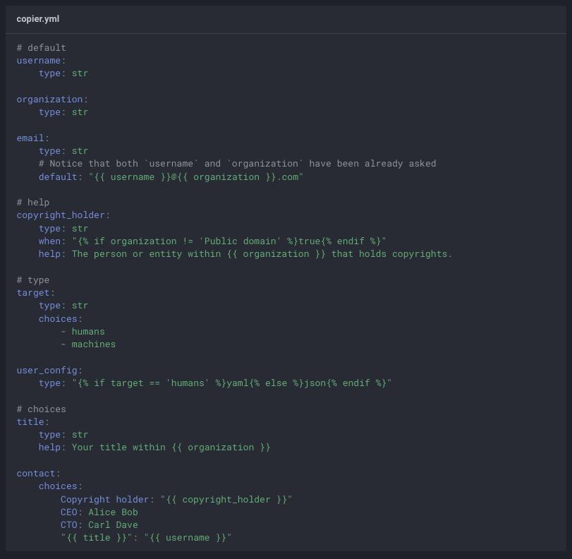

# What we need to prepare?

<v-clicks>

1. Install env - recommend uv 
2. File for our template - .template
3. Questions in copier.yml
  

</v-clicks>

::right::

<v-clicks>

4. Prepare templates files - use Jinja 

</v-clicks>
<!--
-->