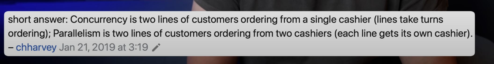

Fullstack improvements repo 

TODO: 
* List - so dropdown list and save result - for interviews 
* Do templates for different programming languages
* Tier list - Different groups knowledge Must Should Okey Perfect

Decorator vs ContextManger (with)
__enter__ __exit__

Profiling code (cProfile, memory_profiler) PerformanceAndOptimization
Optimizing with Cython, PyPy

Microservices architecture

Dependency Injection
https://lagom-di.readthedocs.io/en/latest/
"If you are looking for an idea to write a library that could benefit hashtag#python community, please write a decent dependency injection container 🙏

Just joking. We have too many of them already. Worse, they often don't provide the basic features you'd expect from a dependency injection container. One day on Reddit I found out that two new were announced nearly at the same time and one of them hasn't had scopes support.

On top of this, many teams are writing their own implementations. 🙈

I hope we'll see 1-3 libraries taking over most of the market soon.

The one I like the most is called Lagom https://lnkd.in/dr6m56QF 
It requires little configuration, has integrations with many frameworks and does not require code modification, so it does not litter there.
DISCLAIMER: I recently made a small contribution to that library.

An interesting alternative is dishka https://lnkd.in/d8uQ9x4r I haven't used it yet but seems to be only slightly more verbose.

Any other DI container you use and can recommend?

PS: Please don't rely on the one that ships with FastAPI, it prevents code reuse and hinders testing"
https://www.linkedin.com/posts/sebastianbuczynski_lagom-dependency-injection-container-activity-7268271574493843456-l-Qk?utm_source=share&utm_medium=member_desktop

Which data structures? itertools and functools
Collections (namedtuple, deque, Counter)
Pub Sub

Debugging techniques and tools (pdb, logging)

Dependency Injection

Mocking and patching

Class
Metaclasses
Design patterns
MRO
Keywords
Basic type in python 
SDLC

GIL is mutex, that allows only one thread at time to execute python bytecode

Let's go deeper in async. Exceptions handling, pubsub pattern and how to manage back pressure.

https://www.youtube.com/watch?v=GpqAQxH1Afc

ADR PROCESS
Onboarding Docs

AWS
Lambda

Event Brige
Steep Functions

Debbugger 
Error mesage
whart Error I know 

CORS errors 
waht to logout

https://learnxinyminutes.com/docs/python/